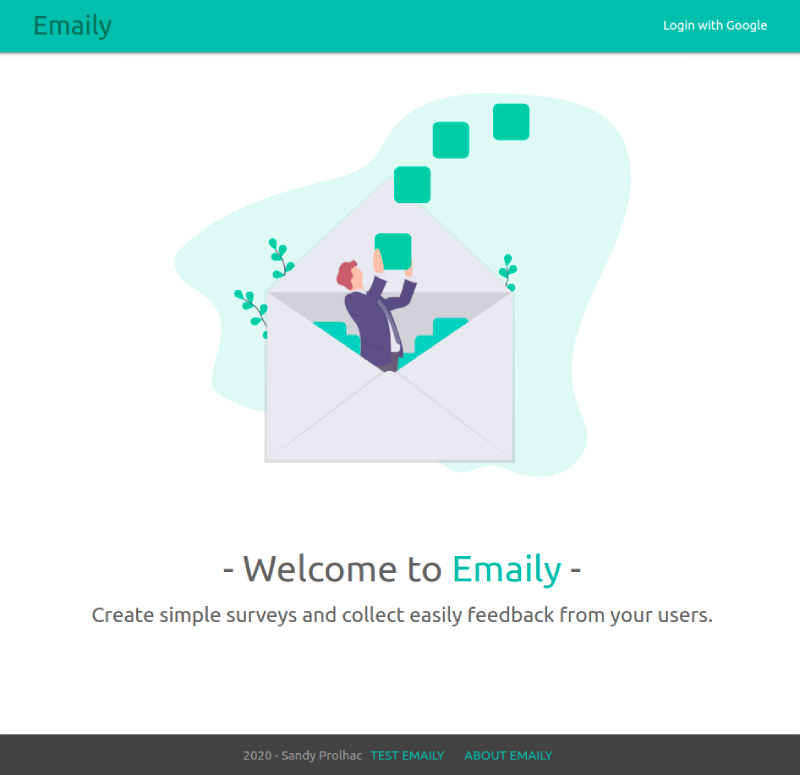
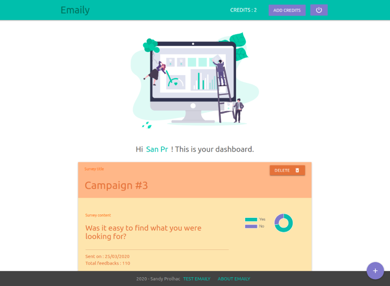

# Emaily

> Send surveys and receive feedbacks.

## Table of contents

-   [General info](#general-info)
-   [Screenshots](#screenshots)
-   [Technologies](#technologies)
-   [Features](#features)
-   [Status](#status)
-   [Inspiration](#inspiration)
-   [Contact](#contact)

## General info

Create and send easily surveys with yes-no questions. Be informed when a user responds to the survey and get simple statistics on the amount of responses.

[See Demo here](https://emaily-app-node-react.herokuapp.com/)

## Screenshots

## Technologies

-   React - version 16.13.0
-   Redux - version 4.0.5
-   Node - version 10.16.0
-   Express - version 4.17.1
-   Mongoose - version 5.9.3
-   Stripe - version 8.29.0
-   Sendgrid - version 5.2.3
-   Passport - version 0.4.1
-   Passport Google OAuth20 - version 2.0.0

## Features

To-do list:

-   Save draft surveys

## Status

Project is: _in progress_

## Inspiration

Project based on the Udemy course [Node with React: Fullstack Web Development](https://www.udemy.com/course/node-with-react-fullstack-web-development/) by Stephen Grider.

## Contact

Created by [Sandy Prolhac](https://www.linkedin.com/in/sandy-prolhac/) - feel free to contact me!
